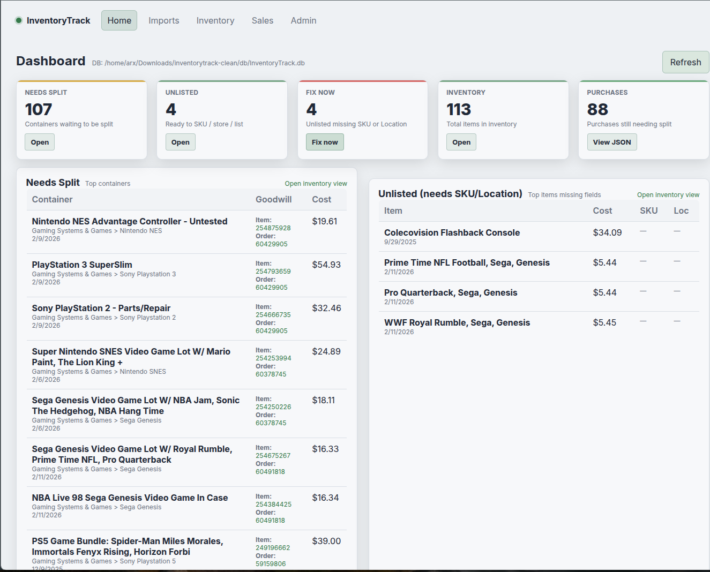

# InventoryTrack

🚧 **Active Development**

InventoryTrack is a work-in-progress inventory and cost-tracking application built with Python, FastAPI, SQLite, and a lightweight JavaScript frontend.

It was originally developed to manage items purchased from sources such as ShopGoodwill and track those items through inventory and eventual resale. The application focuses on accurate cost allocation, inventory reconciliation, and maintaining auditable relationships between purchases, individual inventory items, and sales.



## Features

- Import purchase and order data
- Track individual inventory items from bulk purchases
- Split multi-item purchases into separate inventory records
- Allocate shipping, taxes, handling, and fees across individual items
- Preserve original purchase totals when allocating costs
- Import and reconcile eBay sales data
- Match sold items back to inventory
- Track item status, SKU, location, and cost
- Dashboard, inventory, sales, import, and administrative views
- Deterministic monetary calculations and allocation rules
- Automated tests for core application behavior and data integrity

## Technology

- Python
- FastAPI
- SQLite
- Uvicorn
- Jinja2
- JavaScript
- pytest
- openpyxl

## Getting Started

### Requirements

- Python 3
- Python `venv` support

Clone the repository:

```bash
git clone git@github.com:ark71/inventorytrack.git
cd inventorytrack
```

Start InventoryTrack:

```bash
./run.sh
```

On the first run, the startup script will automatically:

1. Create a Python virtual environment in `.venv`
2. Install the required Python dependencies
3. Create and verify the local SQLite database
4. Start the FastAPI application with Uvicorn

Open a browser to:

```text
http://127.0.0.1:8000
```

Subsequent launches use the same command:

```bash
./run.sh
```

## Database

InventoryTrack uses a local SQLite database stored at:

```text
db/InventoryTrack.db
```

Database files are excluded from Git and are not included in the repository.

The included `create_db.py` utility creates the database from the project schema and verifies required tables, indexes, and foreign-key relationships.

## Testing

The project includes a pytest test suite. With the virtual environment activated:

```bash
source .venv/bin/activate
pytest
```

Tests cover core functionality including monetary calculations, inventory creation, SKU generation, imports, database schema requirements, and application invariants.

## Design Goals

InventoryTrack is designed around several principles:

- Monetary calculations should be deterministic and reproducible.
- Allocated costs should reconcile exactly to their original totals.
- Inventory transformations should preserve accounting relationships.
- Imported source data should remain traceable.
- Destructive database operations should be deliberate.
- Business logic should be testable independently from the user interface.

Additional implementation and development notes are available in the `docs/` directory.

## Project Status

InventoryTrack is an active personal software project and is still under development. Features, database structures, and workflows may change as the application evolves.

The project is being developed primarily as a practical tool rather than as a demonstration or tutorial application.
